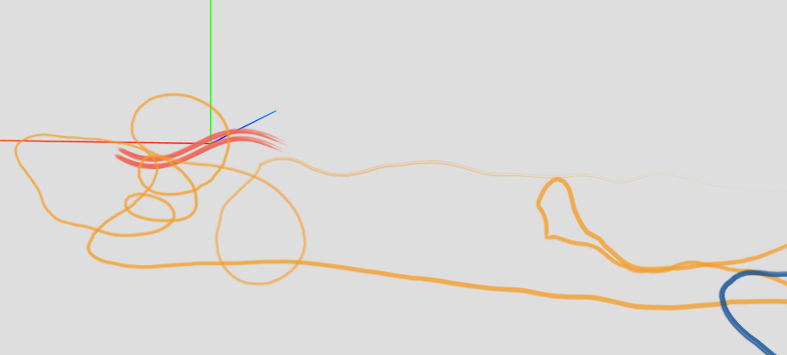

threejs回显json路径

path.html-曲线（无法自定义宽度）

graph.html-可以自定义宽度的曲线

brush.html-画笔刷

composition.html-整合线条，荧光线条，笔刷，文字
> 字体库转换地址:ttf -> json (https://gero3.github.io/facetype.js/)

composition_TTFLoader.html-整合线条，荧光线条，笔刷，文字
> 使用three.js TTFLoader .ttf字体包显示文字，不使用json文件，大大减少了网页资源

[参考文档-纯JS代码解决字体文件过大的前后端方案](https://www.freesion.com/article/31801254192/)

[参考文档node-fontmin-project](https://github.com/font-size/node-fontmin-project)
https://github.com/ecomfe/fontmin
> 通过一个接口请求，返回只包含页面中的字体的font文件，解决了中文字体库过大的问题，特别是移动端的页面，速度提升很大
> 字体切割程序
-------

[three.js英文文档](https://threejs.org/)

[three.js中文文档](http://www.webgl3d.cn/Three.js/)

[three.js文档](http://www.yanhuangxueyuan.com/threejs/docs/index.html#api/zh/materials/MeshBasicMaterial.wireframeLinewidth)

[github-THREE.MeshLine](https://github.com/spite/THREE.MeshLine)

[参考博客及评论](https://blog.csdn.net/u014529917/article/details/98986816)

[参考博客](https://www.freesion.com/article/3567885104/)

[参考博客](https://blog.csdn.net/qq_41741576/article/details/102392914)

[相关文档](http://www.dwenzhao.cn/profession/netbuild/html5three.html)
